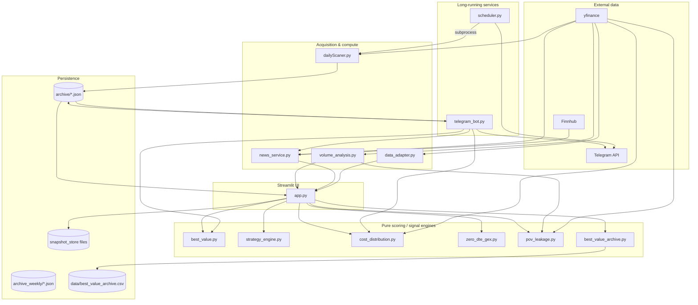
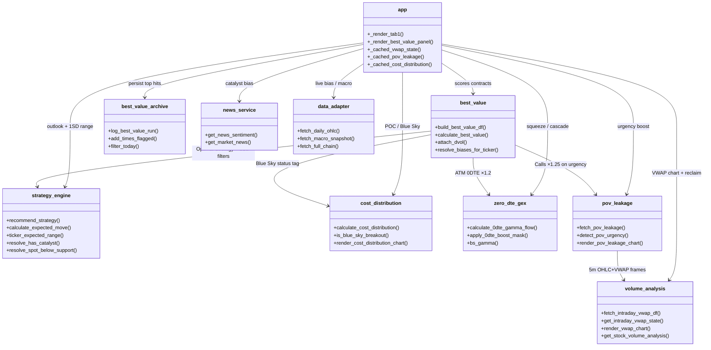
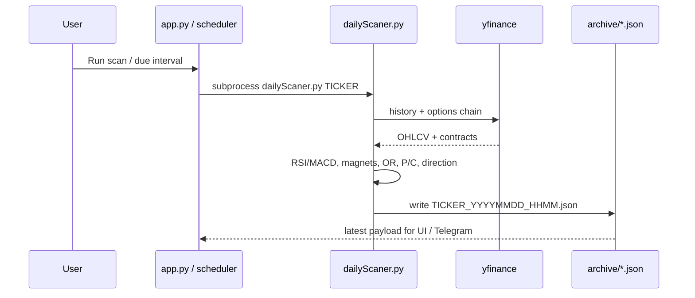
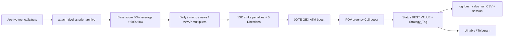
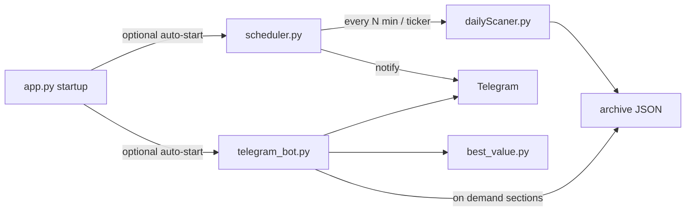

# Options Trading Scanner

Institutional-style options flow scanner with a Streamlit dashboard, background scheduler, and Telegram alerts.

The system separates **data acquisition / signal computation** (`dailyScaner.py`) from a **display + ranking layer** (`app.py` and pure scoring modules). Archive JSON files are the contract between them.

---

## Table of contents

1. [Quick start](#quick-start)
2. [High-level architecture](#high-level-architecture)
3. [Module map & relationships](#module-map--relationships)
4. [Data flow](#data-flow)
5. [Dashboard layout (Zones)](#dashboard-layout-zones)
6. [Scoring pipeline (Best Value)](#scoring-pipeline-best-value)
7. [Signal modules](#signal-modules)
8. [Runtime services](#runtime-services)
9. [Persistence](#persistence)
10. [Configuration](#configuration)
11. [Tests](#tests)
12. [Hard constraints](#hard-constraints)

---

## Quick start

```bash
# 1. Python deps (typical)
pip install streamlit pandas numpy plotly yfinance pytz altair optionlab

# 2. Secrets
cp .env.example .env
# fill TELEGRAM_BOT_TOKEN, TELEGRAM_CHAT_ID, FINNHUB_API_KEY

# 3. First scan (writes archive/{TICKER}_*.json)
python dailyScaner.py AAPL

# 4. Dashboard
streamlit run app.py

# Optional background services (also auto-launched by the dashboard)
python scheduler.py
python telegram_bot.py
```

Market hours and per-ticker scan intervals live in `scheduler_config.json`.

---

## High-level architecture



### Design principles

| Layer | Responsibility | May import `yfinance`? |
|---|---|---|
| `dailyScaner.py` | Full scan: OHLC, indicators, options chain, magnets, archive write | Yes |
| `data_adapter.py` | Thin live OHLC / chain / macro helpers for the UI | Yes (only dashboard adapter) |
| `volume_analysis.py`, `cost_distribution.py`, `pov_leakage.py`, `news_service.py` | Focused market helpers | Yes (isolated) |
| `best_value.py`, `strategy_engine.py`, `zero_dte_gex.py` | Pure ranking / math | No |
| **`app.py`** | Streamlit display + orchestration | **Never** (enforced by tests / convention) |

---

## Module map & relationships

This project is mostly **function modules**, not class-heavy OOP. Relationships below are import / call dependencies.

### Core modules

| Module | Role | Key entry points | Depends on |
|---|---|---|---|
| `dailyScaner.py` | Primary scanner; writes archive JSON | CLI `python dailyScaner.py TICKER` | yfinance, pandas |
| `app.py` | Streamlit dashboard (5 tabs, 5 zones on Flow) | `streamlit run app.py` | Almost all signal modules |
| `scheduler.py` | Market-hours loop; runs scans; Telegram notify | `python scheduler.py` | `dailyScaner` via subprocess |
| `telegram_bot.py` | Interactive Telegram reports | `python telegram_bot.py` | `best_value`, `news_service`, `cost_distribution` |
| `data_adapter.py` | Live daily OHLC, macro SPY/QQQ/VIX, full chain | `fetch_daily_ohlc`, `fetch_macro_snapshot`, `fetch_full_chain` | yfinance |
| `news_service.py` | Catalyst / headline sentiment | `get_news_sentiment`, `get_market_news` | Finnhub → yfinance fallback |
| `best_value.py` | Shared Best Value scorer (dashboard + Telegram) | `build_best_value_df`, `calculate_best_value` | strategy / cost / 0DTE / POV |
| `strategy_engine.py` | 5 Directions + 1SD expected move | `recommend_strategy`, `ticker_expected_range` | — |
| `cost_distribution.py` | 6-month volume-at-cost profile (POC, Blue Sky) | `calculate_cost_distribution` | yfinance |
| `volume_analysis.py` | VWAP reclaim + buy/sell volume + multi-TF charts | `get_intraday_vwap_state`, `render_vwap_chart` | yfinance |
| `pov_leakage.py` | Percent-of-volume participation spikes | `fetch_pov_leakage`, `render_pov_leakage_chart` | `volume_analysis` |
| `zero_dte_gex.py` | 0DTE gamma squeeze / cascade detector | `calculate_0dte_gamma_flow` | — (BS gamma from archive IV) |
| `best_value_archive.py` | Persist top Best Value hits across refreshes | `log_best_value_run` | Streamlit session + CSV |
| `spread_gate.py` | Vertical-spread risk gate (optionlab) | `evaluate_spread_gate` | optionlab |
| `snapshot_store.py` | Chain snapshot ΔVol for Spread Gate tab | `load_snapshot`, `compute_deltas` | — |
| `weekly.py` | Weekly / earnings-oriented scan path | CLI | yfinance |

### Relationship diagram (scoring stack)



### Acquisition → archive



---

## Data flow

### Archive JSON (source of truth for UI)

Each successful `dailyScaner.py` run writes:

`archive/{TICKER}_{YYYYMMDD}_{HHMM}.json`

Typical top-level fields consumed by the dashboard:

| Field | Used for |
|---|---|
| `spot`, `timestamp`, `direction` | Header / KPIs |
| `session` | Open / high / low / prev close, daily bias fallback |
| `volume.top_calls` / `top_puts` | Magnets, Best Value, expiry drill-down, 0DTE GEX |
| `volume.pc_ratio` | Skew / term structure |
| `timeframes` | Multi-TF RSI / MACD matrix |
| `signal_magnets` | Magnet shift alerts |
| `or_data` | Opening range breakout |

Live-only overlays (not stored in archive): VWAP reclaim, POV leakage, cost distribution, news sentiment, macro SPY/QQQ/VIX.

### Best Value end-to-end



---

## Dashboard layout (Zones)

`app.py` → **Options Flow** tab (`_render_tab1`):

| Zone | Contents |
|---|---|
| **1 — Header & KPIs** | Direction banner, Spot/SPY/QQQ/VIX/Daily Bias/VWAP, 1SD range, strategy label, **0DTE Gamma Flow** card |
| **2 — Workspace** | Multi-TF VWAP candlesticks, **POV leakage** chart, Volume Analysis, Multi-TF matrix, Portfolio editor |
| **3 — Catalyst** | Collapsed news / sentiment expander |
| **4 — Execution** | Best Value scanner (scored top 5 + signals / targets / Optimal Strategy) |
| **5 — Deep dive** | Tabs: Flow Magnets · Expiration Breakdown · Cost Distribution |

Other main tabs:

1. **Options Flow** — zones above  
2. **Scanner Archive** — Best Value hit ledger + expiry master-detail chain  
3. **Spread Gate** — live chain + optionlab gate + snapshots  
4. **Tickers** — active / excluded tickers + scan intervals  
5. **Market News** — Finnhub / Yahoo headlines for selected ticker  

Theme: `.streamlit/config.toml` (dark, primary `#00E676`).

---

## Scoring pipeline (Best Value)

Shared by **dashboard** and **Telegram** via `best_value.py` — do not duplicate scoring elsewhere.

### Base score

\[
Value\_Score = 0.4 \cdot norm(leverage) + 0.6 \cdot norm(flow)
\]

- **Leverage** ≈ `(delta × spot) / premium` (delta defaults to 0.5 if missing)  
- **Flow** ≈ `(volume / OI) × |ΔVol|` (missing prior ΔVol → neutral, not phantom surge)

### Contextual multipliers (order matters)

1. Daily bias / market state / news side skew  
2. VWAP reclaim sniper (×1.5 aligned side)  
3. **Strategy engine**
   - Strike outside 1SD → ×0.2  
   - `(+2)` slightly OTM calls in band → ×1.5  
   - `(+1)` OTM calls ×0.5, ATM/ITM calls ×1.3  
   - `(0)` iron condor regime → directional premium ×0.3  
4. **0DTE GEX** — ATM 0DTE calls or puts ×1.2 on squeeze/cascade  
5. **POV urgency** — all calls ×1.25 when last 5m bar ≥3× avg volume **and** price &gt; VWAP  

`Strategy_Tag` / Signal column surfaces which boosts or penalties applied.

### 5 Directions (`strategy_engine.recommend_strategy`)

| Outlook | Condition | Strategy string |
|---|---|---|
| +2 | HEAVY BULLISH + Profited Shares ≥ 95% | Long Call |
| +1 | HEAVY BULLISH otherwise | Bull Call Spread |
| 0 | NEUTRAL, no catalyst | Iron Condor |
| V | NEUTRAL + catalyst | Straddle / Strangle |
| −1 | HEAVY BEARISH | Bear Put Spread |
| −2 | HEAVY BEARISH + below VWAP/cost support | Long Put |

1SD expected move:

\[
EM = Spot \times IV \times \sqrt{DTE / 365}
\]

---

## Signal modules

### VWAP reclaim — `volume_analysis.py`

- 5m typical-price VWAP (session reset)  
- States: `RECLAIMED UP/DOWN`, `TRENDING ABOVE/BELOW`  
- Chart timeframes: 5M, 10M, 45M, 1H, 4H, 1D  

### Cost distribution — `cost_distribution.py`

- ~6 months daily volume binned by typical price  
- POC, Profited Shares %, 70%/90% value areas  
- Blue Sky when Profited ≥ 95% and HEAVY BULLISH  

### 0DTE GEX — `zero_dte_gex.py`

- Filter `DTE == 0`  
- `0DTE_Call_Ratio`, `Net_0DTE_Gamma = Σ(vol·γ_call) − Σ(vol·γ_put)`  
- Squeeze (≥65% calls + positive GEX) / Cascade (≤35% calls + negative GEX)  

### POV leakage — `pov_leakage.py`

- `Participation_Spike_Ratio = Vol / Avg_Vol_15`  
- Magenta leak at ≥ 3.0×; urgency if leak **and** close &gt; VWAP  

### Best Value archive — `best_value_archive.py`

- Appends each refresh’s top contracts (deduped by ticker + archive timestamp)  
- `Times_Flagged` persistence counter for the ET day  
- CSV: `data/best_value_archive.csv`  

---

## Runtime services



- **PID lock**: `scheduler.pid` prevents duplicate schedulers (not committed).  
- **Auth**: Telegram bot only responds to `TELEGRAM_CHAT_ID`.  

---

## Persistence

| Path | Purpose |
|---|---|
| `archive/` | Daily scanner JSON (gitignored) |
| `archive_weekly/` | Weekly scan outputs (gitignored) |
| `data/best_value_archive.csv` | Best Value hit history (gitignored) |
| `tickers_excluded.json` | Local exclude list (keep personal / untracked) |
| `scheduler_config.json` | Intervals + market hours |
| `.env` | Secrets (gitignored); see `.env.example` |

---

## Configuration

### `.env`

```text
TELEGRAM_BOT_TOKEN=...
TELEGRAM_CHAT_ID=...
FINNHUB_API_KEY=...
```

### `scheduler_config.json`

```json
{
  "market_open": "09:30",
  "market_close": "16:00",
  "default_interval_min": 5,
  "notify_telegram": true,
  "tickers": {
    "AAPL": { "interval_min": 3 }
  }
}
```

### `.streamlit/config.toml`

Dark theme, primary color `#00E676`, minimal toolbar.

---

## Tests

```bash
pytest test_dailyScaner_regressions.py test_spread_gate.py tests/
```

Notable regressions covered in `test_dailyScaner_regressions.py`:

- Opening-range window correctness  
- 0DTE magnet eligibility / after-hours exclusions  

---

## Hard constraints

1. **`app.py` must not contain the string `yfinance`** — live market IO goes through adapter / helper modules.  
2. **Best Value scoring is single-sourced** in `best_value.py` for UI and Telegram parity.  
3. **Display layer prefers archives** for structural signals; live helpers only for VWAP, POV, cost profile, news, and macro.  
4. All user-facing times are **America/New_York (ET)**.  

---

## Repository layout (abbreviated)

```text
optionTrading/
├── app.py                  # Streamlit dashboard
├── dailyScaner.py          # Scanner → archive JSON
├── scheduler.py            # Timed multi-ticker scans
├── telegram_bot.py         # Interactive alerts
├── best_value.py           # Shared scoring engine
├── strategy_engine.py      # 5 Directions + 1SD EM
├── cost_distribution.py    # Volume-at-cost / Blue Sky
├── volume_analysis.py      # VWAP + volume analysis
├── pov_leakage.py          # POV participation spikes
├── zero_dte_gex.py         # 0DTE gamma reflexivity
├── best_value_archive.py   # Hit ledger persistence
├── news_service.py         # Catalyst sentiment
├── data_adapter.py         # Dashboard yfinance adapter
├── spread_gate.py          # Spread risk gate
├── snapshot_store.py       # Chain snapshot deltas
├── weekly.py               # Weekly scan path
├── .streamlit/config.toml
├── .env.example
├── scheduler_config.json
├── archive/                # gitignored outputs
└── data/                   # gitignored BV archive CSV
```

---

## License / ownership

Personal trading research stack. Treat API keys and live positions as sensitive; never commit `.env` or broker credentials.
